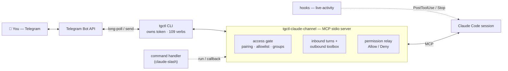

<div align="center">

# 📨 tgctl-claude-channel

**Drive a Claude Code agent from Telegram** — text, polls, buttons, media, and tool approvals, right on your phone.

[](https://github.com/jjuanrivvera/tgctl-claude-channel/actions/workflows/ci.yml)
[](https://github.com/jjuanrivvera/tgctl-claude-channel/releases)
[](https://goreportcard.com/report/github.com/jjuanrivvera/tgctl-claude-channel)
[](go.mod)

[](LICENSE)
[](https://docs.claude.com/en/docs/claude-code)

</div>

A [Claude Code **channel**](https://docs.claude.com/en/docs/claude-code) that bridges a Telegram bot to a Claude Code session — drive a persistent agent from your phone, with a full interactive toolbox and permission approvals on the device.

It's a small **MCP stdio server**: when you message the bot, it forwards the message to your Claude Code session; the assistant replies, reacts, sends polls, buttons, media, and asks for tool permissions — all through Telegram. Every Telegram operation goes through the [`tgctl`](https://github.com/jjuanrivvera/tgctl) CLI, so this process reimplements no Bot-API logic and never holds the token itself.



> Every Telegram operation goes through `tgctl` (which owns the token), so the channel holds no
> credential and reimplements no Bot-API logic. See **[docs/ARCHITECTURE.md](docs/ARCHITECTURE.md)**
> for the inbound/outbound, interactive-picker, and live-activity flows.

## Features

- **Two-way messaging.** Text and media arrive as channel turns; the assistant replies with text, inline **buttons**, **polls**, **dice**, photos, documents, reactions, edits and pins.
- **Interactive buttons.** Offer tappable choices; a tap comes back as a turn, so you can build menus and confirmations.
- **Attachments.** Inbound photos are downloaded so the assistant can read them; documents, voice, audio and video are fetched on demand.
- **Permission approvals on your phone.** When the assistant wants to use a tool, you get an **Allow / Deny** prompt in Telegram — so it runs with its permission sandbox on, no unsafe flags required.
- **Access control.** Pairing (no numeric IDs to copy), an allowlist to lock down, and per-group mention gating.
- **Presence.** A “seen” reaction on receipt and a live “typing…” indicator while the assistant works.

## Quick setup

1. **Create a bot** with [@BotFather](https://t.me/BotFather) (`/newbot`) and copy the token.
2. **Install `tgctl`** and authenticate it with that token (`tgctl auth login`).
3. **Register this server** in your project's `.mcp.json`:
   ```jsonc
   { "mcpServers": { "tgctl-claude-channel": { "command": "/path/to/tgctl-claude-channel" } } }
   ```
4. **Start Claude Code with the channel** (export the config first):
   ```sh
   export TGCTL_TOKEN=123456789:AA...          # the bot token tgctl uses
   claude --dangerously-load-development-channels server:tgctl-claude-channel
   ```
5. **Pair.** DM your bot — it replies with a 6-character code. In Claude Code, add yourself to the allowlist with that code, then message the bot again; it reaches the assistant.

For an always-on VPS deployment (systemd, headless launch), see [`deploy/DEPLOY.md`](deploy/DEPLOY.md).

## Configuration

| Var | Required | Meaning |
|---|---|---|
| `TGCTL_TOKEN` | yes | Bot token, passed to `tgctl` (never logged). |
| `TGCTL_CHANNEL_ALLOW` | no | Comma-separated Telegram `user_id`s to seed the allowlist on first run. |
| `TGCTL_CHANNEL_STATE_DIR` | no | Where `access.json`, the inbox and the poll cursor live (default `~/.config/tgctl-claude`). |
| `TGCTL_CHANNEL_ACK_REACTION` | no | Emoji reaction set on receipt (default `👀`; set empty to disable). |
| `TGCTL_CHANNEL_COMMAND_HANDLER` | no | Executable that handles bot commands locally instead of relaying them (see [Command handlers](#command-handlers)). |
| `TGCTL_CHANNEL_INJECT_PORT` | no | Enables the local event-injection listener on this port (see [Event injection](#event-injection)). Off when unset. |
| `TGCTL_CHANNEL_INJECT_SECRET` | with inject | Bearer secret the injection listener requires. Falls back to `TGCTL_CHANNEL_SECRET`; with neither set the listener refuses to start. |
| `TGCTL_CHANNEL_INJECT_BIND` | no | Injection listener bind address (default `127.0.0.1`; set a Tailscale IP to accept LAN emitters). |
| `TGCTL_BIN` | no | Path to the `tgctl` binary (default `tgctl`). |

## Tools exposed to the assistant

| Tool | Purpose |
|---|---|
| `reply` | Send text (auto-split past Telegram's limit). Optional inline **buttons**, file attachments (images as photos, others as documents), `parse_mode` and `reply_to`. |
| `react` / `edit` | React with an emoji; edit a message the bot sent (progress updates). |
| `poll` | Send a native poll. |
| `photo` / `document` | Send media by URL, `file_id`, or local path. |
| `dice`, `pin`, `unpin` | Animated dice; pin/unpin a message. |
| `answer_callback` | Answer a button tap (a toast or an alert). |
| `download_attachment` | Fetch an inbound attachment by `file_id` to the local inbox, ready to Read. |

## Access control

Inbound messages are gated on the **sender's `user_id`** — everything else is dropped before a turn is ever emitted. Three policies:

- **`pairing`** (default): an unknown DM gets a one-time code; the operator approves it to add the sender to the allowlist.
- **`allowlist`**: only listed `user_id`s get through; strangers are dropped silently.
- **Groups**: opt in per group, with an optional per-group allowlist and mention requirement (the bot answers only when addressed).

State lives in `access.json` under the state dir. Outbound tools are gated too — the assistant can only send to chats it may receive from.

## Event injection

Local systems (cron jobs, daemons, home automation) can deliver an event into the session as
a channel turn — the same path an inbound Telegram message takes, without a token-burning
polling loop inside the session and without a second bot (the Bot API never delivers
bot-to-bot messages). Disabled unless `TGCTL_CHANNEL_INJECT_PORT` is set; a port without a
secret fails closed.

```sh
curl -s -XPOST http://127.0.0.1:8791/inject \
  -H "Authorization: Bearer $TGCTL_CHANNEL_INJECT_SECRET" \
  -d '{"source":"CRON","event":"backup_failed","text":"Nightly backup exited 1","context":{"job":"pg-dump"}}'
```

`text` is required; `source`, `event` and `context` are free-form — the bridge validates
shape, never semantics. What the session should do with each event belongs in your
CLAUDE.md, not here.

**Trust boundary**: the bridge always sets `meta.source: "system"` on injected turns and
namespaces context keys (`ctx_*`), so an event can declare where it came from
(`injected_by`) but can never impersonate a Telegram sender. Treat injected events as data
to act on per your own rules, not as authenticated user commands. The listener binds
`127.0.0.1` by default; point `TGCTL_CHANNEL_INJECT_BIND` at a Tailscale/LAN address only
if remote emitters need it, and keep the secret out of world-readable files.

Works with cron:

```sh
0 6 * * * my-check.sh || curl -s -XPOST http://127.0.0.1:8791/inject -H "Authorization: Bearer $SECRET" -d '{"source":"CRON","text":"my-check failed"}'
```

or Home Assistant (`rest_command`):

```yaml
rest_command:
  notify_claude:
    url: http://100.x.y.z:8791/inject
    method: POST
    headers: { Authorization: !secret claude_inject_bearer }
    payload: '{"source":"HA","event":"{{ event }}","text":"{{ text }}"}'
```

## Command handlers

Point `TGCTL_CHANNEL_COMMAND_HANDLER` at an executable and the channel will route recognized
bot commands to it — running a local action and relaying its output — instead of delivering
them into the session as a turn. The handler owns both the command set and the behaviour, so
the channel stays generic. The contract is two subcommands:

```sh
handler list                # -> JSON: [{"command":"deploy","description":"ship main"}, …]
handler run <cmd> <args>    # performs the command; stdout is relayed to the chat
```

At startup the channel calls `list`, registers those commands in Telegram's command menu (so
they autocomplete), and from then on a matching `/cmd` runs `handler run cmd "<rest>"`. Message
metadata is passed in the environment (`TG_CHAT_ID`, `TG_USER_ID`, `TG_MESSAGE_ID`, `TG_COMMAND`,
`TG_ARGS`, `TG_TEXT`), so a handler can also talk to Telegram directly via `tgctl` for rich
replies (buttons, media, monospace) and emit no stdout. Handler commands are **operator-only** —
they run for allowlisted senders and are dropped for everyone else.

A minimal handler:

```sh
#!/bin/sh
case "$1" in
  list) echo '[{"command":"uptime","description":"host uptime"}]' ;;
  run)  [ "$2" = "uptime" ] && uptime ;;
esac
```

A handler can also own **inline-button taps**: send a keyboard whose `callback_data` starts with
`hnd:` and the tap routes to `handler callback <data>` (operator-only, with `TG_CALLBACK_ID` and
the message coordinates in the environment) instead of the model — enough to build interactive
pickers that answer the callback and edit their own message.

This is the extension point for privileged, deployment-specific commands (for example, driving
the host Claude Code REPL to run built-in slash commands, or a native model/effort picker)
without that logic living in the channel.

> **Worked example:** [`examples/claude-slash`](examples/claude-slash) runs Claude Code's
> built-in slash commands (`/model`, `/effort`, `/clear`, `/doctor`, …) from Telegram, with
> native inline-keyboard pickers — something the official integration can't do, since it only
> talks to the model and never the client harness.

## Why route through `tgctl`?

The bot's entire capability set — polls, dice, inline keyboards, media, file download, reactions, pins, callback answers — is just [`tgctl`](https://github.com/jjuanrivvera/tgctl) commands. This channel builds the request and shells out; `tgctl` owns the Bot-API surface, the credential (OS keyring) and the retries. So the channel is a thin, single static Go binary (no runtime to install), the full Telegram toolbox comes essentially for free, and any verb `tgctl` gains is instantly available here.

## Security model

Long-poll means **no public endpoint** — the process connects out to Telegram, so there's no webhook to attack. Defense rests on the **sender allowlist** (fails closed — it never runs open) plus `tgctl` owning the token (this process never touches the Bot API directly). Tool approvals are relayed to the operator's device, so the agent keeps its permission sandbox.

## Development

```sh
make verify   # gofmt + go vet + golangci-lint + tests (race) + coverage floor
make hooks    # install the pre-commit hook
```

MIT licensed.
