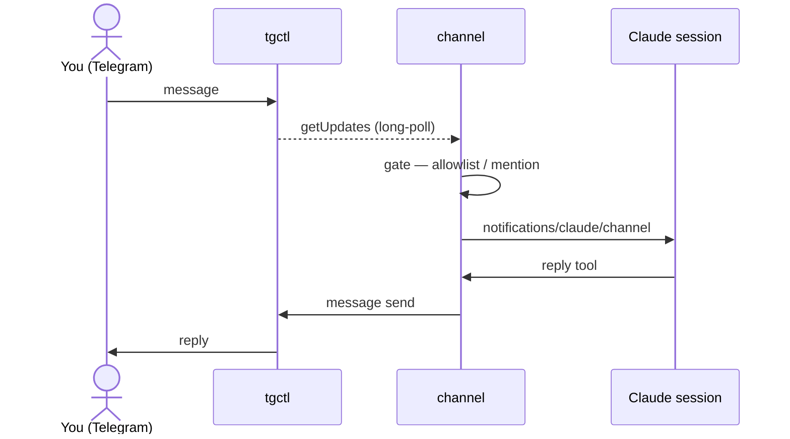
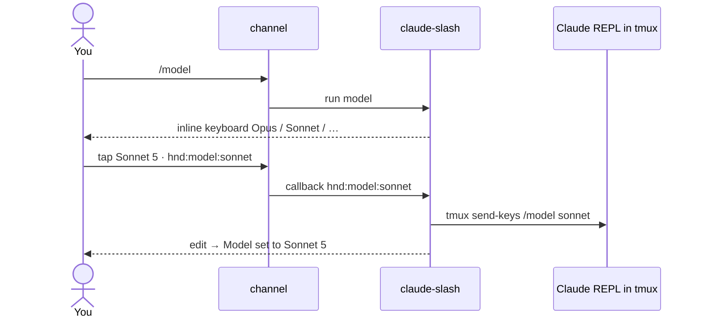
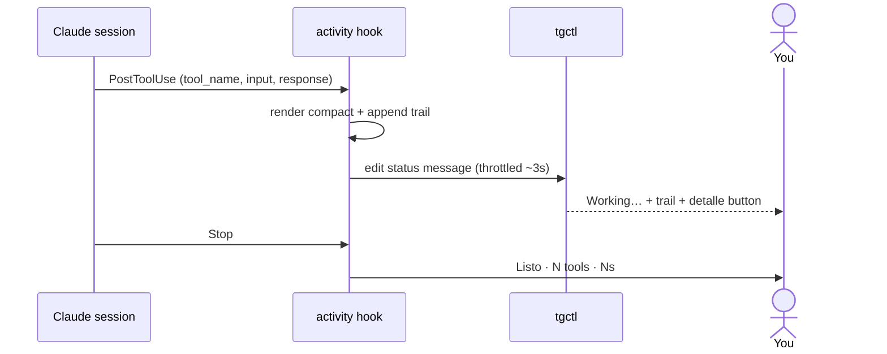

# Architecture

`tgctl-claude-channel` is a small [Claude Code **channel**](https://docs.claude.com/en/docs/claude-code):
an MCP stdio server that bridges a Telegram bot to a Claude Code session. It does two jobs and
delegates everything else:

- **Transport** — every Telegram read and write goes through the [`tgctl`](https://github.com/jjuanrivvera/tgctl)
  CLI, which owns the bot token (OS keyring) and speaks the Bot API. The channel holds no credential.
- **Routing + safety** — it gates inbound messages (pairing / allowlist / group mention), turns them
  into `notifications/claude/channel` turns, exposes an outbound toolbox to the agent, and relays tool
  permission prompts to the device.

Anything deployment- or task-specific is an **external plug-in**, so the core stays generic:
a [command handler](../README.md#command-handlers) (e.g. `examples/claude-slash`, which runs
built-in slash commands) and Claude Code **hooks** (e.g. `examples/live-activity`, the live feed).

## Inbound → outbound

A message becomes a turn; the agent answers through a tool that shells out to `tgctl`. No webhook,
no public endpoint — the channel long-polls `tgctl updates get`.

## Interactive commands (native pickers)

A bot command can be handled locally by a command handler instead of reaching the model. Button
taps namespaced `hnd:` route to the same handler, so it can offer native inline keyboards and act
on the choice — for example, a `/model` picker whose tap runs the arg form in the real REPL.

Built-in slash commands (`/model`, `/clear`, `/doctor`, …) are client-side harness operations —
the model can't trigger them and channel input never reaches the slash parser — so the handler
types them into the real REPL (which runs in tmux) with `send-keys`. That coupling is exactly why
it lives outside the channel.

## Live activity feed

Claude Code **hooks** fire on every tool call and on turn end. A `PostToolUse` hook renders a
compact line per action and keeps **one** self-editing Telegram message (a rolling trail, throttled
to respect edit rate limits); a `Stop` hook collapses it to a summary. A `[detalle]` button expands
diffs / command output / grep hits on demand via the same `hnd:` callback routing.

A hook must never disturb the turn, so the script prints nothing and always exits 0.

## Design principle

The channel is a **generic transport with two extension points** — command handlers (messages +
`hnd:` callbacks → a local executable) and Claude Code hooks (tool/turn events). Everything specific
to *this* deployment (tmux, Claude's built-ins, the activity rendering) is an external plug-in. The
result: the core reimplements no Bot-API logic, holds no token, and stays small and general, while
the interesting behavior is composed on top.
